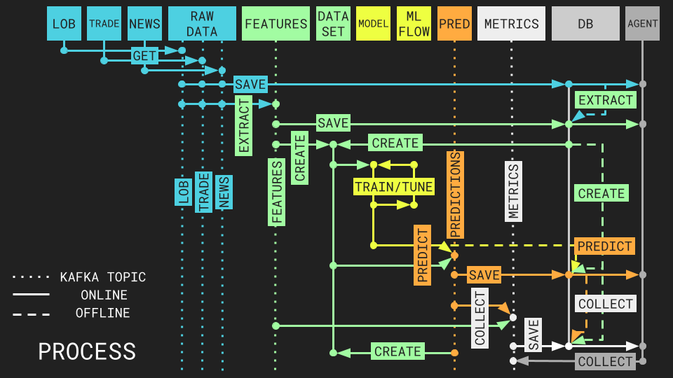
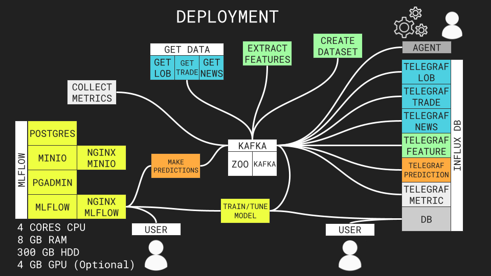
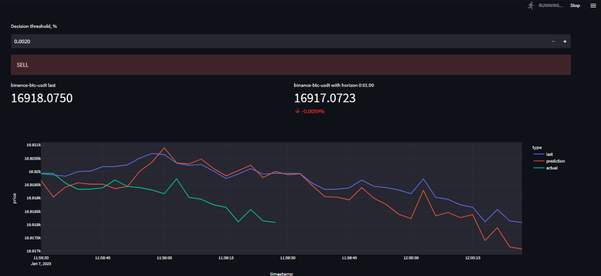
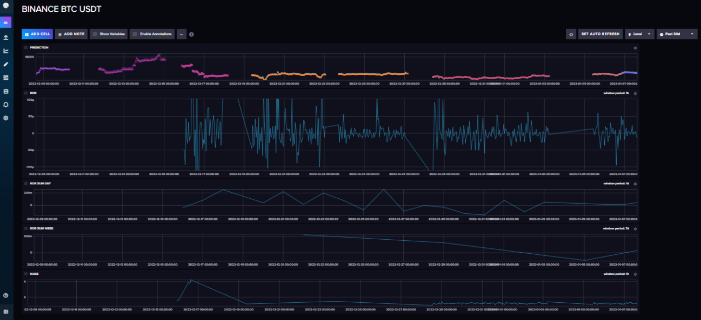
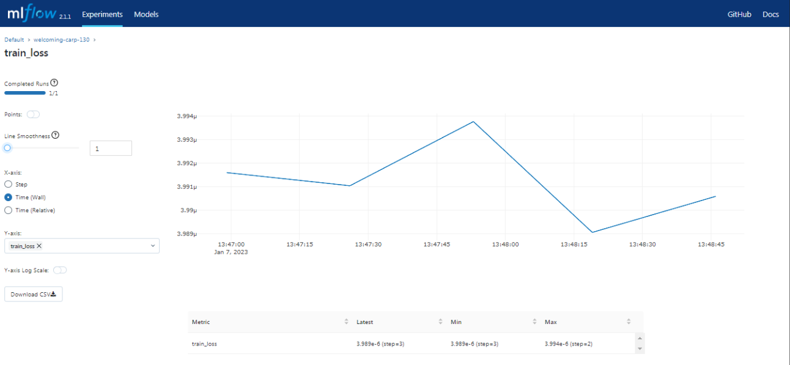

# CCF
Crypto Currency Forecasting App for [ML System Design Course on ODS.ai](https://ods.ai/tracks/ml-system-design-22)

## Architecture


App consists of 6 main parts
> We could install and run different parts of the App independently
### $$\textcolor{#4dd0e1}{\text{DATA}}$$
In this part data from `exchanges` and `news rss` are collected in the `raw data` database/steam.
### $$\textcolor{#a2fca2}{\text{FEATURES}}$$
Here are continiuos feature extracting from `raw data` database/stream and saving in the `feature store`. `Dataset` creation occurs dynamically at the ML and PREDICTIONS parts, but the logic is described here
### $$\textcolor{#eeff41}{\text{ML}}$$
Here we create `datasets`, train/tune `models` and add/update them in the `models registry`
### $$\textcolor{#ffab40}{\text{PREDICTIONS}}$$
This part is for making `predictions` based on `models` from `models registry` and `datasets`
### $$\textcolor{#eeeeee}{\text{METRICS}}$$
There are metrics collectors and monitors with techincal information about `raw data`, `features`, training/tuning, `models`, `predictions`, etc
### $$\textcolor{#adadad}{\text{UI}}$$
We show `users`: `predictions`, performance `metrics`, `raw data`, etc. This part uses some information from METRICS part
## Process

## Deployment


## RUN DOCKER
### DOCKER WITH MLFLOW
```sh
cd docker
```
### Generate self-signed certificate for InfluxDB
```sh
sudo openssl req -x509 -nodes -newkey rsa:2048 -keyout influxdb-selfsigned.key -out influxdb-selfsigned.crt -days 365
```
### Set sensitive environment variables for InfluxDB
```sh
cp .env.secret.db.example .env.secret.db
```
### Run docker compose with Kafka
```sh
docker compose -f docker-compose.kafka.yaml up -d
```
### Run docker compose with InfluxDB
```sh
docker compose -f docker-compose.db.yaml up -d
```
### Build CCF Image
```sh
docker compose -f docker-compose.binance.btc.usdt.yaml build
```
### Run docker compose with get_data, extract_features and collect_metrics
```sh
docker compose -f docker-compose.binance.btc.usdt.yaml up -d
```
### Set sensitive environment variables for MLflow
```sh
cp .env.secret.mlflow.example .env.secret.mlflow
```
### Generate password for user "ccf" for NGINX proxy of MLflow
```sh
htpasswd -c .htpasswd ccf
```
### Run docker compose with MLflow
```sh
docker compose -f docker-compose.mlflow.yaml up -d
```
### Set sensitive environment variables for models (password from previous step)
```sh
cp .env.secret.model.example .env.secret.model
```
### Run docker compose with train model
```sh
docker compose -f docker-compose.binance.btc.usdt.train.mlflow.yaml up -d
```
### Run docker compose with predict model
```sh
docker compose -f docker-compose.binance.btc.usdt.predict.mlflow.yaml up -d
```
### Run docker compose with Streamlit UI (localhost:8501)
```sh
docker compose -f docker-compose.binance.btc.usdt.ui.yaml up -d
```
### Monitor Streamlit (host: localhost:8501)

### Monitor InfluxDB (host: localhost:8086, user: ccf, password: see .env.secret.db)

### Monitor MLflow (host: localhost:5000, user: ccf, password: see .env.secret.model)


## DOCKER WITHOUT MLFLOW
```sh
cd docker
```
### Generate self-signed certificate for InfluxDB
```sh
sudo openssl req -x509 -nodes -newkey rsa:2048 -keyout influxdb-selfsigned.key -out influxdb-selfsigned.crt -days 365
```
### Set sensitive environment variables for InfluxDB
```sh
cp .env.secret.db.example .env.secret.db
```
### Run docker compose with Kafka
```sh
docker compose -f docker-compose.kafka.yaml up -d
```
### Run docker compose with InfluxDB
```sh
docker compose -f docker-compose.db.yaml up -d
```
### Build CCF Image
```sh
docker compose -f docker-compose.binance.btc.usdt.yaml build
```
### Run docker compose with get_data, extract_features and collect_metrics
```sh
docker compose -f docker-compose.binance.btc.usdt.yaml up -d
```
### Run docker compose with train model
```sh
docker compose -f docker-compose.binance.btc.usdt.train.yaml up -d
```
### Run docker compose with predict model (periodically restart this compose to update model)
```sh
docker compose -f docker-compose.binance.btc.usdt.predict.yaml up -d
```
### Run docker compose with Streamlit UI (host: localhost:8501)
```sh
docker compose -f docker-compose.binance.btc.usdt.ui.yaml up -d
```
### Monitor Streamlit (host: localhost:8501)
### Monitor InfluxDB (host: localhost:8086, user: ccf, password: see .env.secret.db)

## RUN MANUAL
### INSTALL
#### Python 3.9
#### $$\textcolor{#ffffff}{\text{ALL}}$$ 
```sh
pip install -r requirements.txt
```
#### $$\textcolor{#4dd0e1}{\text{DATA}}$$ 
```sh
pip install -r src/ccf/requirements_data.txt
```
#### $$\textcolor{#a2fca2}{\text{FEATURES}}$$
```sh
pip install -r src/ccf/requirements_features.txt
``` 
#### $$\textcolor{#eeff41}{\text{ML}}$$ 
```sh
pip install -r src/ccf/requirements_ml.txt
```
#### $$\textcolor{#ffab40}{\text{PREDICTIONS}}$$ 
```sh
pip install -r src/ccf/requirements_predictions.txt
```
#### $$\textcolor{#eeeeee}{\text{METRICS}}$$
```sh
pip install -r src/ccf/requirements_metrics.txt
```
#### $$\textcolor{#adadad}{\text{UI}}$$
```sh
pip install -r src/ccf/requirements_ui.txt
```
### RUN
```sh
cd work
```
#### $$\textcolor{#4dd0e1}{\text{GET DATA}}$$ 
* Linux (by default)
```sh
PYTHONPATH=../src/ python ../src/ccf/get_data.py -cd conf -cn get_data-kafka-binance-btc-usdt
```
* Windows (as example)
```sh
cmd /C  "set PYTHONPATH=../src && python ../src/ccf/get_data.py -cd conf -cn get_data-kafka-binance-btc-usdt"
```
#### $$\textcolor{#a2fca2}{\text{EXTRACT FEATURES}}$$
```sh
PYTHONPATH=../src/ python ../src/ccf/extract_features.py -cd conf -cn extract_features-kafka-binance-btc-usdt
```
#### $$\textcolor{#eeff41}{\text{TRAIN/TUNE MODEL}}$$ 
* Train once
```sh
PYTHONPATH=../src/ python ../src/ccf/train.py -cd conf -cn  train-mid-lograt-tft-kafka-binance-btc-usdt
```
* Tune every ~1 hour
```sh
while true; do PYTHONPATH=../src/ python ../src/ccf/train.py -cd conf -cn train-mid-lograt-tft-kafka-binance-btc-usdt; sleep 3600; done
```
#### $$\textcolor{#ffab40}{\text{MAKE PREDICTIONS}}$$
```sh
PYTHONPATH=../src/ python ../src/ccf/predict.py -cd conf -cn predict-mid-lograt-tft-kafka-binance-btc-usdt
```
#### $$\textcolor{#ffab40}{\text{COLLECT PREDICTIONS METRICS}}$$
```sh
PYTHONPATH=../src/ python ../src/ccf/collect_metrics.py -cd conf -cn collect_metrics-kafka-binance-btc-usdt
```
#### $$\textcolor{#eeeeee}{\text{MONITOR METRICS}}$$ 
* Monitor metrics with InfluxDB (host: localhost:8086, user: ccf, password: see .env.secret.db)
* Monitor metrics with MLflow (host: localhost:5000, user: ccf, password: see .env.secret.model)
* Tensorboard (localhost:6007)
```sh
cd work
tensorboard --logdir tensorboard/ --host 0.0.0.0 --port 6007
```
#### $$\textcolor{#adadad}{\text{RUN UI}}$$
* Streamlit (localhost:8501)
```sh
PYTHONPATH=../src/ streamlit run ../src/ccf/apps/ui.py conf/ui-mid-lograt-tft-kafka-binance-btc-usdt.yaml
```
## CONFIGS EXAMPLES
### $$\textcolor{#4dd0e1}{\text{GET DATA}}$$
`work/conf/get_data-kafka-binance-btc-usdt.yaml`
```yaml
defaults:
 - _self_
 - partitioner@agents.lob.partitioner: lob
 - partitioner@agents.trade.partitioner: trade
 - partitioner@agents.news.partitioner: news
 - feeds@agents.news.feeds: all

executor:
  class: ProcessPoolExecutor
  max_workers: 3
agents:
  lob:
    class: Lob
    topic: lob
    keys: [ binance-btc-usdt ]
    delay: 1
    timeout: 60
    depth: 5
    verbose: true
    producer:
      bootstrap_servers: "kafka:9092"
    partitioner: ~
    app: ~
    run: ~
    executor:
      class: ProcessPoolExecutor
      max_workers: 1
  trade:
    class: Trade
    topic: trade
    keys: [ binance-btc-usdt ]
    delay: 1
    timeout: 60
    verbose: true
    producer:
      bootstrap_servers: "kafka:9092"
    partitioner: ~
    app: ~
    run: ~
    executor:
      class: ProcessPoolExecutor
      max_workers: 1
  news:
    class: Feed
    topic: news
    feeds: {}
    delay: ~
    start: -3600
    timeout: 5
    feeds_per_group: ~
    verbose: 2
    producer:
      bootstrap_servers: "kafka:9092"
    partitioner: ~
    executor:
      class: ProcessPoolExecutor
      max_workers: 1
```
### $$\textcolor{#a2fca2}{\text{EXTRACT FEATURES}}$$
`work/conf/extract_features-kafka-binance-btc-usdt.yaml`
```yaml
defaults:
  - partitioner@consumer.partitioners.lob: lob
  - partitioner@consumer.partitioners.trade: trade
  - partitioner@producer.partitioners.feature: feature
  - _self_

quant: 3.0e+9
consumer:
  bootstrap_servers: "kafka:9092"
producer:
  bootstrap_servers: "kafka:9092"
agents:
  a_1:
    class: Delta
    verbose: true
    consumers:
      c_1:
        topic_keys:
          lob: [ binance-btc-usdt ]
          trade: [ binance-btc-usdt ]
    producers:
      p_1:
        topic_keys:
          feature: [ binance-btc-usdt ]
```
### $$\textcolor{#eeff41}{\text{TRAIN/TUNE}}$$ 
`work/conf/train-mlflow-mid-lograt-tft-kafka-binance-btc-usdt.yaml`
```yaml
defaults:
 - _self_
 - partitioner@create_dataset_kwargs.agents.a_1.consumer.partitioners.feature: feature
 - dataset@create_dataset_kwargs.dataset_kwargs: mid-lograt-kafka-binance-btc-usdt

kind: occasional
parent_name: ~
parent_version: ~
parent_stage: ~
model_name: mid-lograt-tft-kafka-binance-btc-usdt
create_dataset_kwargs:
  verbose: false
  quant: 3.0e+9
  size: 1200
  replace_nan: 0.0
  agents:
    a_1: 
      class: KafkaDataset
      verbose: true
      topics: [ feature ]
      executor_kwargs:
        class: ProcessPoolExecutor
        max_workers: 1
      feature_keys:
        Delta-default-lograt: [ binance-btc-usdt ]
      consumer:
        bootstrap_servers: "kafka:9092"
  split: 0.8
dataloader_kwargs:
  train:
    train: true
    num_workers: 0
    batch_size: 8
  val:
    train: false
    num_workers: 0
    batch_size: 8
model_kwargs:
  class: TemporalFusionTransformer
  learning_rate: 0.0078125
  hidden_size: 8
  attention_head_size: 1
  dropout: 0
  hidden_continuous_size: 8
  lstm_layers: 1
  # output_size: 7  # Inferred from loss
  loss:
    class: QuantileLoss
  log_interval: 0
  reduce_on_plateau_patience: 2
  reduce_on_plateau_reduction: 2
  reduce_on_plateau_min_lr: 1.0e-10
  weight_decay: 0
trainer_kwargs:
  max_epochs: 8
  accelerator: cpu  # gpu
  devices: ~
  gradient_clip_val: 0
  log_every_n_steps: 100
  limit_train_batches: ~
  logger:
  - class: TensorBoardLogger
    save_dir: tensorboard
    name: mid-lograt-tft-kafka-binance-btc-usdt
  callbacks:
  - class: LearningRateMonitor
    logging_interval: step
  - class: ModelCheckpoint
    monitor: val_loss
    filename: '{epoch}-{step}-{val_loss:.3f}'
    save_last: true
    save_top_k: 1
  - class: EarlyStopping
    monitor: val_loss
    min_delta: 0
    patience: 4
    verbose: false
    mode: min
```
### $$\textcolor{#ffab40}{\text{MAKE PREDICTIONS}}$$
`work/conf/predict-mlflow-mid-lograt-tft-kafka-binance-btc-usdt.yaml`
```yaml 
defaults:
 - partitioner@agents.a_1.producers.p_1.partitioners.prediction: prediction
 
kind: auto_update
model_name: mid-lograt-tft-kafka-binance-btc-usdt
model_version: ~
model_stage: ~
verbose: false
size: 20
watermark: 6e9
horizons: [ 5, 10, 15, 20 ]
predict_kwargs:
  return_index: true
  mode: prediction  # prediction or quantiles
agents:
  a_1:
    class: Kafka
    producers:
      p_1:
        bootstrap_servers: "kafka:9092"
        topic_keys:
          prediction: [ binance-btc-usdt ]
```
### $$\textcolor{#eeeeee}{\text{MONITOR METRICS}}$$ 
* Use InfluxDB (host: localhost:8086, user: ccf, password: see .env.secret.db)
* Use MLflow (host: localhost:5000, user: ccf, password: see .env.secret.model)
### $$\textcolor{#adadad}{\text{RUN UI}}$$
`conf/work/ui-mid-lograt-tft-kafka-binance-btc-usdt.yaml`
```yaml 
defaults:
  - partitioner@partitioner: prediction
  - _self_

consumer:
  bootstrap_servers: "kafka:9092"
topics: [ prediction ]
keys: [ binance-btc-usdt ]
maxsize: 40
horizon: 20
```
